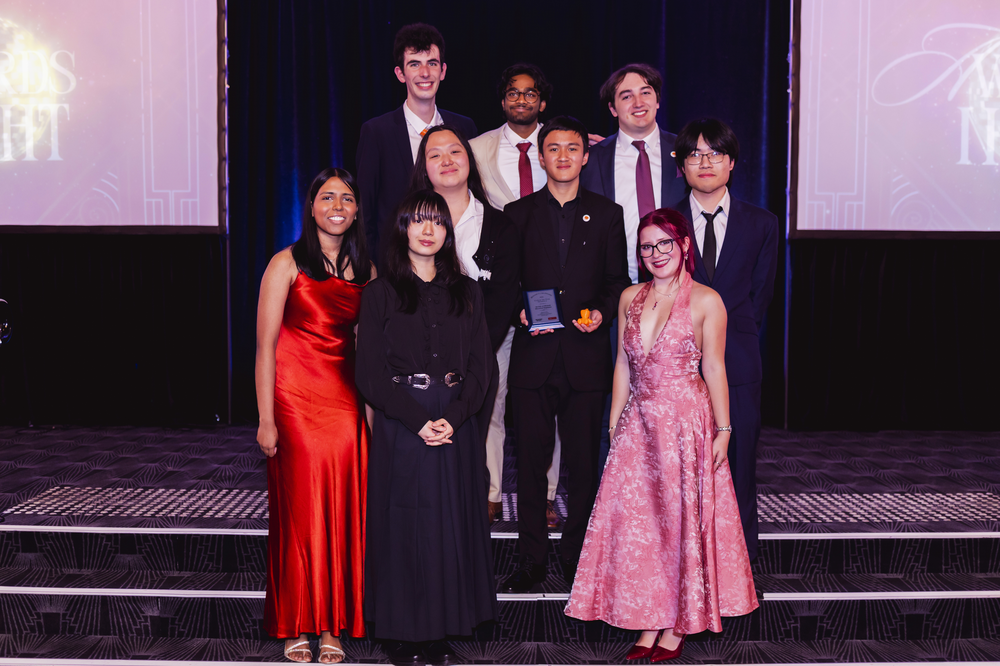
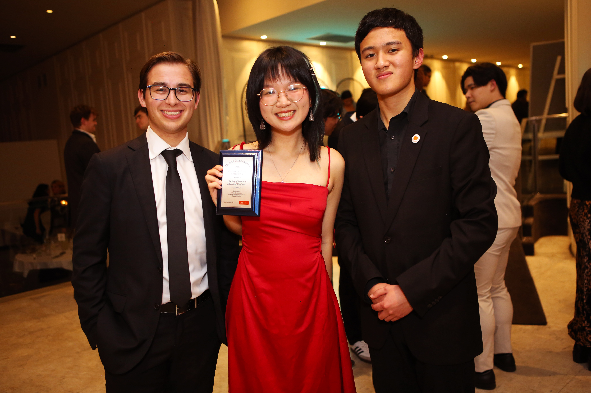

# Club Awards

SMEE has won several awards at the Monash Clubs Awards, including Club of the Year for the past two years.

## 2026 Club of the Year

The Club of the Year - C&S Division 4 award celebrates the most outstanding clubs across all areas of club operations. A club's exceptional dedication to fulfilling its purposes, supporting members and the impact had the wider Monash community are recognised as part of this award.

Judging Criteria: Interactions with the Monash community, events and programs, the value provided to Monash students and interactions with C&S / Monash Sports, and correct and timely submission of documents.

## 2025 Club of the Year

The Club of the Year - C&S Category C award celebrates the most outstanding clubs across all areas of club operations. A club's exceptional dedication to fulfilling its purposes, supporting members and the impact had the wider Monash community are recognised as part of this award.

Judging Criteria: Interactions with the Monash community, events and programs, the value provided to Monash students and interactions with C&S / Monash Sports, and correct and timely submission of documents.

## 2016 Most Outstanding Administration

The Most Outstanding Administration - C&S Category B award recognises excellent administrative practices demonstrated by clubs. These clubs have effectively managed the correct and timely submission of various compliance requirements.

# Honorary Life Member

The following people are awarded the honour of **Honorary Life Member** for substantial contribution to the Society of Monash Electrical Engineers.

| Recipient | Year | Service |
| :---- | :---- | :---- |
| Jonathon Geeves | 2015 | President 2015 |
| Matthew Seymour | 2019 | President Sept 2018 – Sept 2019   Secretary Jan 2018 – Sept 2018 |
| Isuru Peiris | 2023 | President Sept 2022 – Sept 2023 |
| Samuel McMahon | 2023 | Careers and Sponsorship Representative Sept 2022 – Sept 2023 |
| Aarushi Raheja | 2023 | Vice President Sept 2022 – Sept 2023 |
| Lacie Nguyen | 2025 | Vice President Sept 2023 – Sept 2024   President Oct 2024 – Sept 2025 |
| Leonie Chim | 2026 |  |
| Nhan Nguyen | 2026 |  |

# Presidential Honours

## People's Hero of Electrical Engineering

The following people are awarded the honour of **People’s Hero of Electrical Engineering** for an act of the most outstanding contribution to the Society of Monash Electrical Engineers or the students of the Monash University Department of Electrical and Computer Systems Engineering.

| Recipient | Year | Act |
| :---- | :---- | :---- |
| Alexander Chann | 2026 | Solved an enduring SMEE mystery, the contents of a locked box discovered in the ECSE Common Room, by picking its lock. |
| Elliott Varasdi | 2026 | Designed and printed the first run of squishy bois. |
| Steph Koutsimpiris | 2026 | Represented and convened engineering societies in advocating alongside the Monash Student Association for classroom educational quality. |
| Leonie Chim | 2026 | Organised singlehandedly urgent catering over a weekend for a SMEE x MECC x WEM flagship industry event. |

## Electrical Engineer of All Time

The following people are awarded the honour of **Electrical Engineer of All Time** for outstanding service or exceptional achievement.

| Recipient | Year | For |
| :---- | :---- | :---- |
| Eshal Bari | 2026 | Negotiated the establishment of the MEMES Melbourne server. |
| Momo Zhou | 2026 | Hosted SMEE committee members at the University of Melbourne. |
| NINEEYES (██████████████, ███████████, ██████████████, █████████, █████████) | 2026 | Composed and posted ECE2072 memes daily. |
| Timmy Hess | 2026 | Donated a cushion to the ECSE Common Room. |
| Elliott Varasdi | 2026 | Purchased a $300 DE2 from SMEE. |
| Jimin Jeon | 2026 | Diagnosed expertly Timmy’s life companion who was on life support with communication fading, resulting in restoration to full health. |
| Will Yeatman | 2026 | Volunteered at SMEE workshops at inconvenient times despite not being a part of SMEE. |
| Leonie Chim | 2026 | Served and advocated for the ECSE student body as a dedicated SMEE committee member for four years in fulfillment of and beyond their responsibilities. |
| Alan Nie, Amiru Peeli Kumburage, Chhay Irseng, Daniel Dinh | 2026 | Stayed late to solder components for the Robot Building Competition. |
| Aaron Choong | 2026 | Supported and advised the SMEE committee on department, university, financial, resources and wellbeing matters as a consistent friend of the society. |
| Campaign team for Nhan for Lot’s Wife Editor | 2026 | Volunteered extensive time and effort to engage student voters with democracy, help them to make an informed vote and promote safety in student politics. |
| Om Patel | 2026 | Saved a person from a burning building as a goated SMEE member and generally nice guy. |
| Leonie Chim | 2026 | Designed stickers for the People’s Heroes of Electrical Engineering and Electrical Engineers of All Time. |
| Timmy Hess | 2026 | Led and contributed to two successful Robot Building Competitions in quick succession. |
| Michaela Gabbe | 2026 | Organised engineering Open Day and gift cards for society volunteers after MSTI forgot about engineering societies. |
| Ian Reynolds | 2026 | Allowed the SMEE committee to use the ECSE Department trolleys for temporary SMEE needs. |
| Alison Robins | 2026 | Allocated SMEE an underground cage. |
| Andrew Linzner | 2026 | Assisted the SMEE committee with the old lab equipment. |
| Jay Davis | 2026 | Donated electronic components to SMEE. |
| Lee Trinh | 2026 | Gave SMEE a cheque book. |
| 2026S1 SMEE Academic Subcommittee (Leonie Chim, Erin Holland, Om Patel, Sayuni Perera, Arthur Nguyen) | 2026 | Advised the President. |
| Timmy Hess | 2026 | Designed certificates for the People’s Heroes of Electrical Engineering and Electrical Engineers of All Time. |
| Tharinsa Thasandi Rathnayake Rathnayake Mudiyanselage | 2026 | Printed for SMEE including certificates for the People’s Heroes of Electrical Engineering and Electrical Engineers of All Time. |
| Steph Koutsimpiris | 2026 | Printed squishy bois for the People’s Heroes of Electrical Engineering. |
| Sophie Li | 2026 | Compiled the University dates by SMEE calendar. |
| Kevin Healy | 2026 | Created SMEE’s first viral reel. |
| Spiz | 2026 | Served engineers, engineering societies and SMEE. |